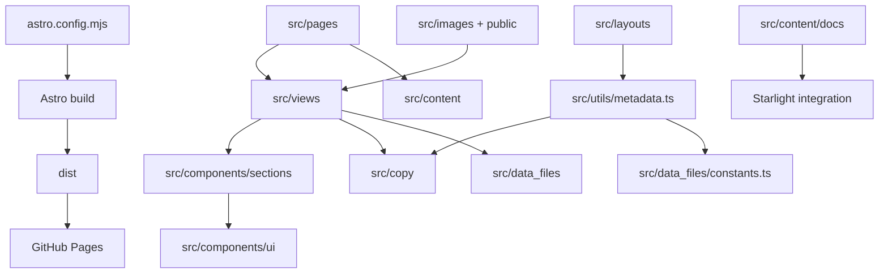

# Rebrand Map

This repo is an Astro site template. The YAGNI/graft strategy is: keep the layouts, routing, metadata helpers, and components; replace brand data, written content, images, links, and product/docs entries.

## Structure Map

```text
ScrewFast
|-- astro.config.mjs              Astro, sitemap, Starlight docs, GitHub Pages base
|-- src/
|   |-- pages/                    Route files for marketing, blog, products, contact, generated assets
|   |-- views/                    Page composition; imports sections and passes copy/data into them
|   |-- layouts/                  Shared page shells and metadata wiring
|   |-- components/               Reusable sections, cards, buttons, forms, nav/footer, Starlight overrides
|   |-- copy/                     Main localized copy tables; most rebrand text starts here
|   |-- data_files/               Structured data: navigation, features, FAQs, pricing, constants
|   |-- content/                  Markdown/MDX content for blog, insights, products, and docs
|   |-- images/                   Local visual assets used by pages and content
|   |-- assets/                   Styles and static support assets
|   `-- utils/                    Locale, metadata, and content helpers
|-- public/                       Static public assets copied as-is
|-- scripts/                      Smoke tests
|-- process-html.mjs              Post-build HTML minification
`-- .github/workflows/            CI and GitHub Pages deployment
```

## Runtime Map



## Rebrand Inventory

Change these first:

- `src/data_files/constants.ts`: brand name, tagline, descriptions, canonical URL, author, Open Graph image, partner logos.
- `src/copy/en.ts` and `src/copy/fr.ts`: page copy, nav labels, CTAs, testimonials, contact text, SEO titles/descriptions.
- `src/data_files/navigation.ts`: route labels are keyed in copy, but paths/social URLs live here.
- `src/data_files/*.json` and `src/data_files/fr/*.json`: features, FAQs, and pricing.
- `src/content/products/*`: product catalog entries.
- `src/content/blog/*` and `src/content/insights/*`: editorial content.
- `src/content/docs/*`: documentation site content and locale-specific docs.
- `src/images/*`, `src/images/blog/*`, `src/images/insights/*`, `src/images/starlight/*`, and `public/*`: product, hero, social, docs, and static images.
- `astro.config.mjs`: production `SITE_URL`, `BASE_PATH`, Starlight title/sidebar/social links, and sitemap settings.

Usually leave these alone:

- `src/utils/*`: locale, metadata, and content routing helpers.
- `src/components/*`: component behavior and layout, unless the new brand needs a different section structure.
- `src/pages/*`: route structure, unless the new site needs different pages.
- `process-html.mjs`, `scripts/smoke.mjs`, `tsconfig.json`, and build tooling.

## Deployment Notes

The Pages workflow builds `dist` from `main` and deploys it using GitHub's Pages artifact flow. For the new `sitszz` repo, URLs are built with:

- `SITE_URL=https://vjk7989.github.io`
- `BASE_PATH=/sitszz`

If the repo later uses a custom domain, set `SITE_URL` to that domain and `BASE_PATH=/` in the workflow or repo variables.
